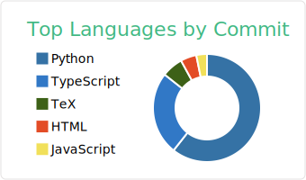

  

  <h2>👋 Hi there, I'm Yuto Kawashima (川嶋 宥翔)</h2>
  <h3>Physics Student @Nagoya Univ. | Aspiring AI × Physics Developer</h3>
  
  

    On GitHub, I share apps, simulations, and tools I’m building while exploring: 
    <b>Machine Learning, AI, Data Analysis, Web Development, and Physics.</b>
  

---

## 🚀 GitHub Activity & Analytics

  
  
   
  
  
  

 

## 🛠️ Tech Stack

  

---

## 📌 Featured Repositories

### 💻 Web & AI Development
- 💊 [**medicine-recommendation-app**](https://github.com/32Lwk/medicine-recommend-system.git)
  - 機械学習を用いた医薬品推奨アプリ (AI-powered Medicine Recommendation)
- 🗾 [**まちサポ (Machi-Sapo)**](https://github.com/32Lwk/machisapo.git)
  - 地域住民が「困っていること」を投稿できるマップ型アプリ (Community Support Map App)
- 🧳 [**TravelBuddy**](https://github.com/32Lwk/TravelBoddy)
  - 旅行の出費管理 × 思い出可視化アプリ (Travel Expense & Memory Manager)
- 🧑‍🌾 [**Agrirecruite**](https://github.com/32Lwk/AgriTech)
  - 愛知県豊橋における農業募集アプリケーション (Agriculture Recruitment App for Toyohashi)

### 🌌 Physics & Simulation
- 🌌 [**N-body simulation**](https://github.com/32Lwk/)
  - 多数の粒子間の重力相互作用を計算し、時間発展や運動を予測 (Gravitational N-body Simulation)
- 🪙 [**硬貨識別 (Coin Identifier)**](https://github.com/32Lwk/coin_identifier/blob/master/README.md)
  - YOLO v8を用いて正確に硬貨の種類を識別 (Coin Detection using YOLO v8)

---

## 📫 Let's Connect

  
I am aiming to join the <b>C-Lab (Theoretical Astrophysics)!</b> 🌌

  
  
    
  
  <code>📧 weary-scoots.7y[at]icloud.com</code>
    
  🎾 <b>Tennis</b> &nbsp;|&nbsp; 🏃‍♂️ <b>Running</b> &nbsp;|&nbsp; 🔭 <b>Astrophysics</b>

