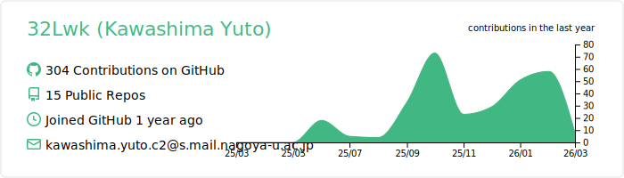
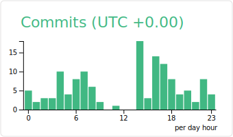
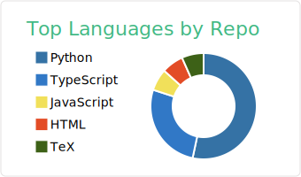

  

  <h1>Hi there, I'm Yuto Kawashima </h1>
  
  

 

### 🧑‍🔬 About Me / 自己紹介

名古屋大学理学部物理学科2年生です。**理論天体物理学**、特に **宇宙の大規模構造** に興味があり、将来は名古屋大学の **宇宙論研究室（C-Lab）** で研究できればと考えています。

**計算物理学**=と**機械学習**を組み合わせた研究に取り組んでみたいと思っており、N-bodyシミュレーションや宇宙の構造形成の数値計算を学んでいます。

課外活動として、**社会課題解決**にも取り組んでいます。和歌山県有田川町出身という経験から、地域医療の課題を実感しました。現在は**登録販売者**として勤務する中で、高齢者や外国人の服薬相談の困難さ、慢性的な人手不足などの現場課題を目の当たりにしています。これらの課題を少しでも解決できればと思い、**医薬品推奨チャットツール**を約1〜2年間、個人開発で進めています。

技術的には、**ルールベース × AI のハイブリッド構成**を採用し、LLMに丸投げせず、医薬品の禁忌・相互作用・年齢制限などをコードで厳格に判定するシステムを構築しています。インメモリ処理や2段階トリアージ、Aho-Corasick法などを活用し、サーバーレス環境でも高速に動作するよう試行錯誤しています。

I'm a 2nd-year undergraduate student in the Department of Physics at Nagoya University. I'm interested in **theoretical astrophysics**, particularly **large-scale structure of the universe**, and hope to conduct research at Nagoya University's **Cosmology Laboratory (C-Lab)** in the future.

I'm eager to explore research that combines **computational physics** and **machine learning**, and I'm currently learning about N-body simulations and numerical calculations of cosmic structure formation.

Beyond academics, I'm also working on **solving social challenges**. Coming from Aridagawa, Wakayama Prefecture, I've experienced firsthand the difficulties in accessing healthcare. Currently working as a **registered salesperson**, I've witnessed challenges such as difficulties in medication counseling for elderly people and foreigners, as well as chronic staff shortages. To address these issues, I've been developing a **medicine recommendation chat tool** for about 1-2 years as a personal project.

Technically, I'm building a system using a **hybrid approach of rule-based logic and AI**, strictly checking drug contraindications, interactions, and age restrictions in code rather than relying entirely on LLMs. I'm experimenting with in-memory processing, two-stage triage, and the Aho-Corasick algorithm to optimize performance in serverless environments.

---

## 🛠️ Tech Stack

  

**主な技術 / Main Technologies:**
- **Backend**: Python, Flask, Flask-SocketIO, Pandas
- **Frontend**: HTML, CSS, JavaScript
- **AI/ML**: OpenAI API (GPT-4o), DeepL API
- **Infrastructure**: Render
- **Others**: Aho-Corasick algorithm, In-memory processing, Two-stage triage

**学習中 / Currently Learning:**
- C, Rust, C++, Go, Swift
- より高度な計算物理学の手法
- 並列計算・GPU計算
- AWS,GCP

---

## 💭 What I'm Working On / 最近取り組んでいること

- 🌌 **宇宙論の基礎学習**: 大規模構造形成の理論と数値計算手法を学んでいます
- 💊 **医薬品推奨ツールの開発**: 安全性と使いやすさの両立を目指して改善を続けています
- 📚 **計算物理学の実践**: N-bodyシミュレーションやモンテカルロ法などの数値計算を実装しながら学んでいます
- 🦀 **Rustの学習**: システムプログラミングとパフォーマンス最適化に興味があります

---

## 🏆 Recent Activities / 最近の活動

- 🥇 学生生成AIコンテスト（ユメカタリ）: 最優秀賞
- 🥈 椙山女学園大学 第13回ビジネスコンペティション: 優秀賞
- 🎯 dodaキャリアゲートウェイ2025-アイデアコンペティション: 審査員特別賞
- 🚀 AWS デジタル社会実現ツアー2025 名古屋: 本戦出場

---

## 🚀 Activity & Analytics

  
  
   
  
  

 

---

## 📌 Featured Repositories

### 💻 Web & AI Development
- 💊 [**medicine-recommendation-app**](https://github.com/32Lwk/medicine-recommend-system.git)
  - 機械学習を用いた医薬品推奨アプリ (AI-powered Medicine Recommendation)
  - ルールベース × AI のハイブリッド構成で安全性を重視したチャットツール
- 💊 [**latent-space-medicine**](https://github.com/32Lwk/latent-space-medicine.git)
  - 潜在空間を用いたOTC医薬品の評価と症状の一致度検出 (Evaluation of OTC Drugs and Symptom Matching using Latent Space)
- 🔮 [**Hidden Treatment Mode Estimation & Cancellation under Uncertainty**](https://github.com/32Lwk/Hidden-Treatment-Mode-Estimation-Cancellation-under-Uncertainty.git)
  - リスク指向型ベイズ停止モデル × 処置モードHMM による日比耳鼻咽喉科の待ち時間予測モデル(Risk-Oriented Bayesian Stopping Model × Treatment-Mode Hidden Markov Model for Predicting Waiting Times)
- 🗾 [**まちサポ (Machi-Sapo)**](https://github.com/32Lwk/machisapo.git)
  - 地域住民が「困っていること」を投稿できるマップ型アプリ (Community Support Map App)
- 🧳 [**TravelBuddy**](https://github.com/32Lwk/TravelBoddy)
  - 旅行の出費管理 × 思い出可視化アプリ (Travel Expense & Memory Manager)
- 🧑‍🌾 [**Agrirecruite**](https://github.com/32Lwk/AgriTech)
  - 愛知県豊橋における農業募集アプリケーション (Agriculture Recruitment App for Toyohashi)

### 🌌 Physics & Simulation
- 🌌 [**N-body simulation**](https://github.com/32Lwk/)
  - 多数の粒子間の重力相互作用を計算し、時間発展や運動を予測 (Gravitational N-body Simulation)
- 🪙 [**硬貨識別 (Coin Identifier)**](https://github.com/32Lwk/coin_identifier/blob/master/README.md)
  - YOLO v8を用いて正確に硬貨の種類を識別 (Coin Detection using YOLO v8)
- 💾 [**データ復元ツール (Memory recovery tool)**](https://github.com/32Lwk/Memory-recovery-tool)
  - RAWリカバリ技術を用いて、ファイルシグネチャに基づいてデータを復元します。 (RAW recovery technology is used to recover data based on file signatures)
- 🎂 [**多言語モンテカルロ法 (monte-carlo-pi-multi-language)**](https://github.com/32Lwk/monte-carlo-pi-multi-language)
  - モンテカルロ法による円周率計算を各言語の特性・書き方の学習とパフォーマンス比較を行うベンチマークプロジェクト。 (A benchmark project that uses the Monte Carlo method to learn the characteristics and writing styles of each language and compare performance when calculating pi.)

---

## 🤝 Let's Connect

  

  
  
  &nbsp;
  
  &nbsp;
  

    
  
  <code>🎾 Tennis</code> • <code>🏃‍♂️ Running</code> • <code>🔭 Astrophysics</code>
   
  <b>Goal: Join the C-Lab! / 目標: C-Labへの参加！</b>

