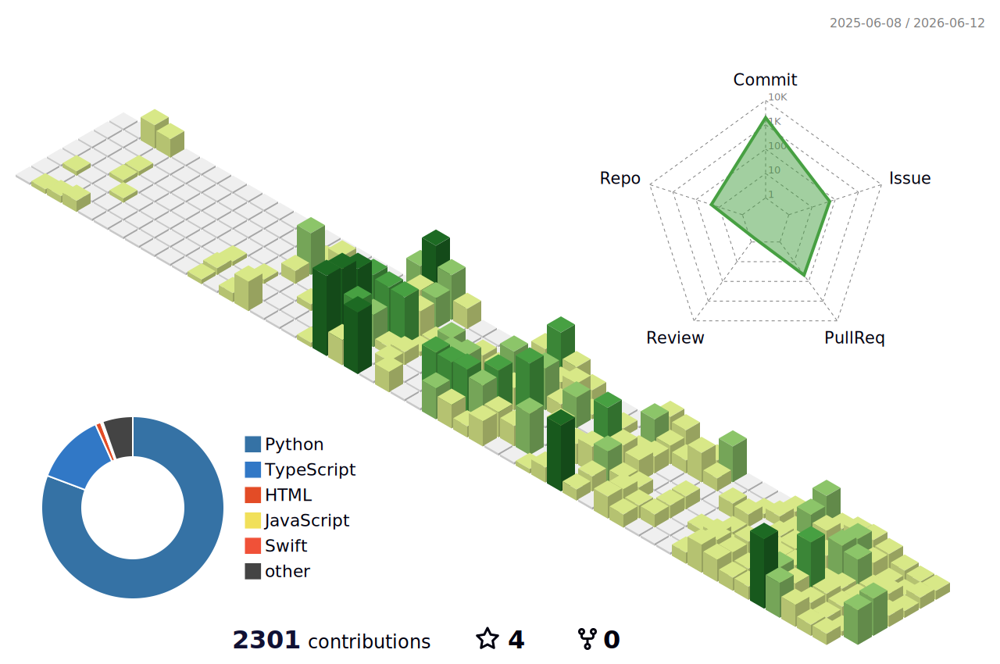
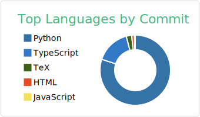

  

  <h1>Hi there, I'm Yuto Kawashima </h1>
  
  

 

### 🧑‍🔬 About Me
I am an undergraduate Physics student at Nagoya University with a strong interest in both Theoretical Astrophysics and Artificial Intelligence.

In addition, I am developing web applications and data analysis tools to expand my technical skills, with the long-term goal of contributing to research in theoretical astrophysics.

> *"Exploring the cosmos through the lens of code."*

---

## 🚀 Activity & Analytics

  
    
  
  
   
  
  

 

## 🛠️ Tech Stack

  

## 🤝 Let's Connect

  
If you are interested in my work or research in Astrophysics, feel free to reach out!

  
  
  &nbsp;
  

    
  
  <code>🎾 Tennis</code> • <code>🏃‍♂️ Running</code> • <code>🔭 Astrophysics</code>
   
  <b>Goal: Join the C-Lab!</b>

