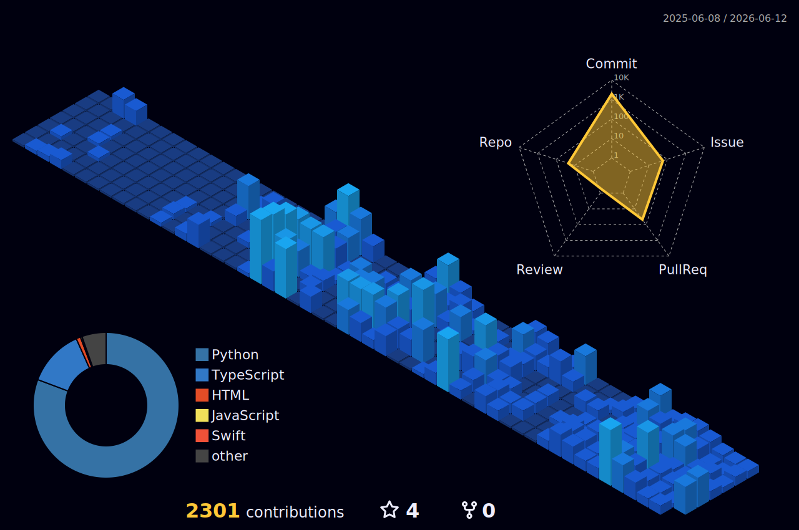
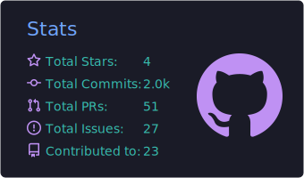
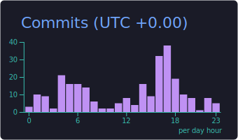
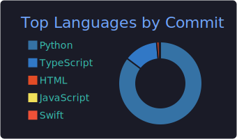

  

  

   

  

---

<h3 align="center">🌌 About Me</h3>

<table>
<tr>
<td valign="top" width="50%">

**Who I am**

Undergraduate **Physics** student at Nagoya University, exploring the intersection of **Theoretical Astrophysics** and **Artificial Intelligence**.

**What I build**

Web applications and data analysis tools — with the long-term goal of contributing to astrophysics research.

</td>
<td valign="top" width="50%">

**Currently**

- 🎓 Physics @ Nagoya University
- 💊 Building [medicine counseling tools](https://medicine.yutok.dev)
- 🔭 Goal: join the **C-Lab**

> *"Exploring the cosmos through the lens of code."*

</td>
</tr>
</table>

---

<h3 align="center">✨ GitHub Activity</h3>

  

    

  
  

   

  

---

<h3 align="center">🛠 Tech Stack</h3>

  

---

<h3 align="center">🤝 Let's Connect</h3>

  
Interested in astrophysics, AI, or collaborative projects? Feel free to reach out — I'd love to connect.

  
  
  
  
  

    

  <code>🎾 Tennis</code> &nbsp; <code>🏃 Running</code> &nbsp; <code>🔭 Astrophysics</code> &nbsp; <code>💻 Side Projects</code>

    

  

